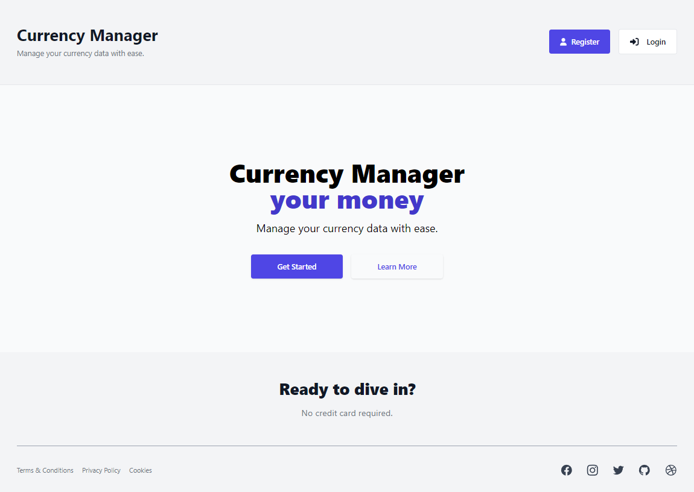
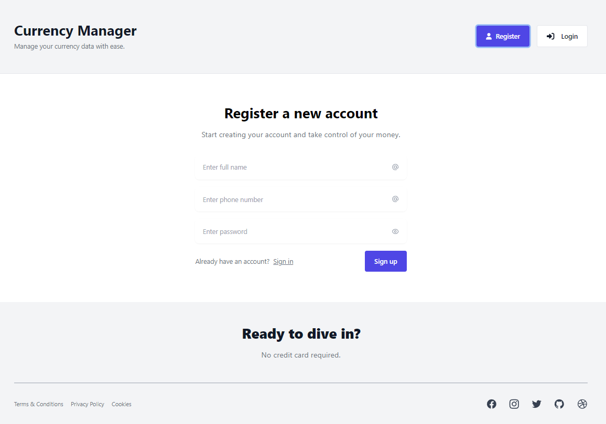
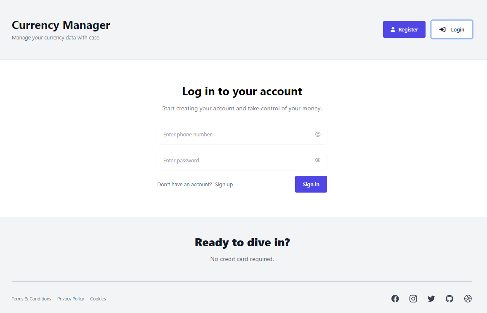
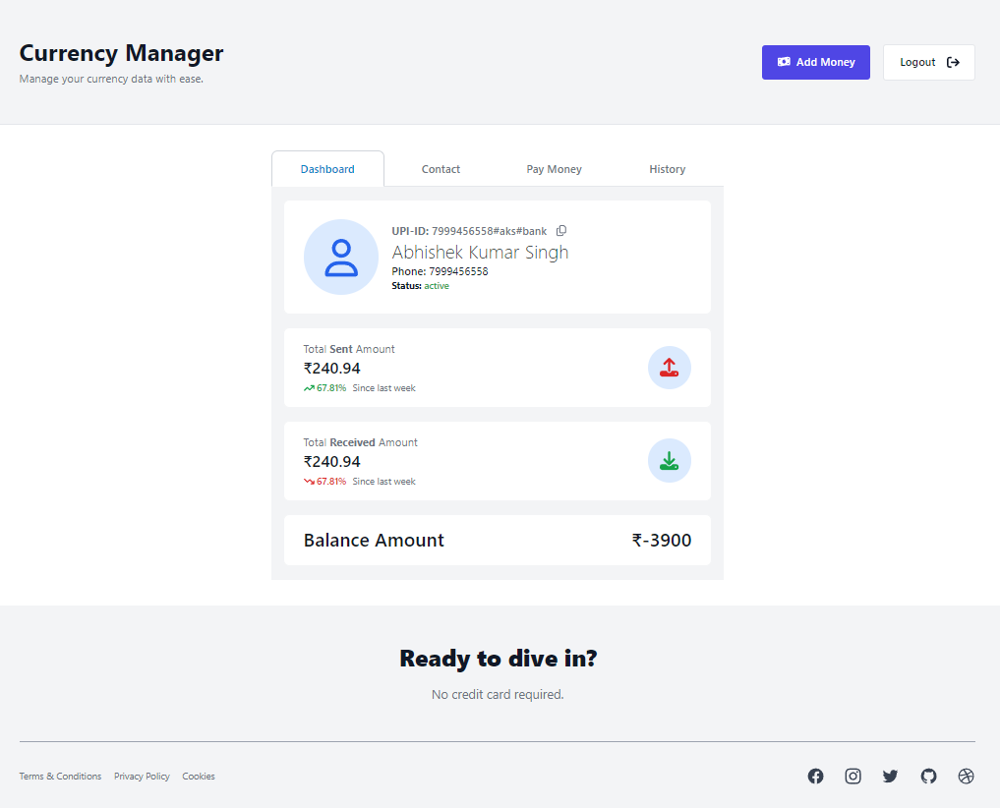
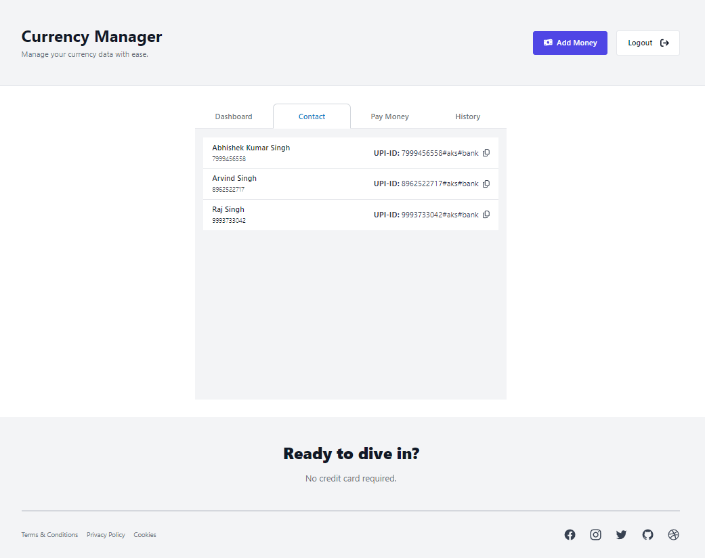
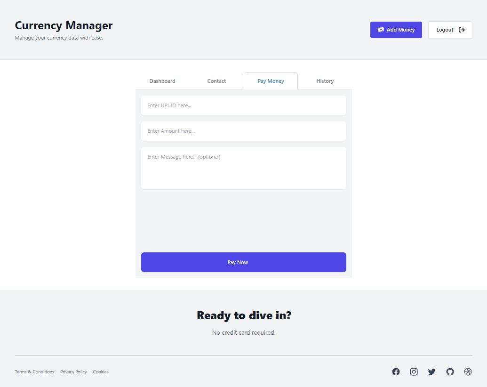
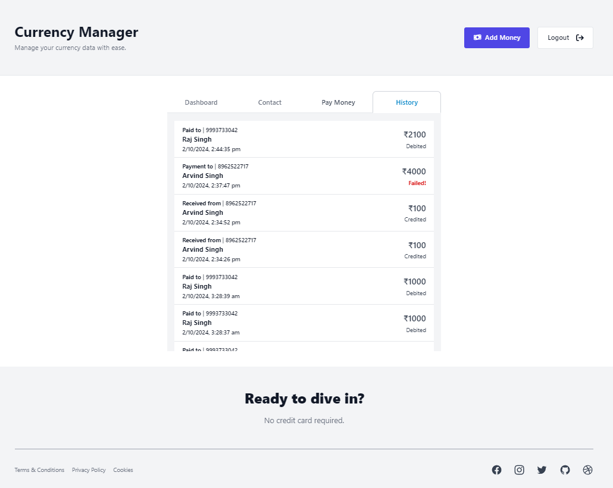
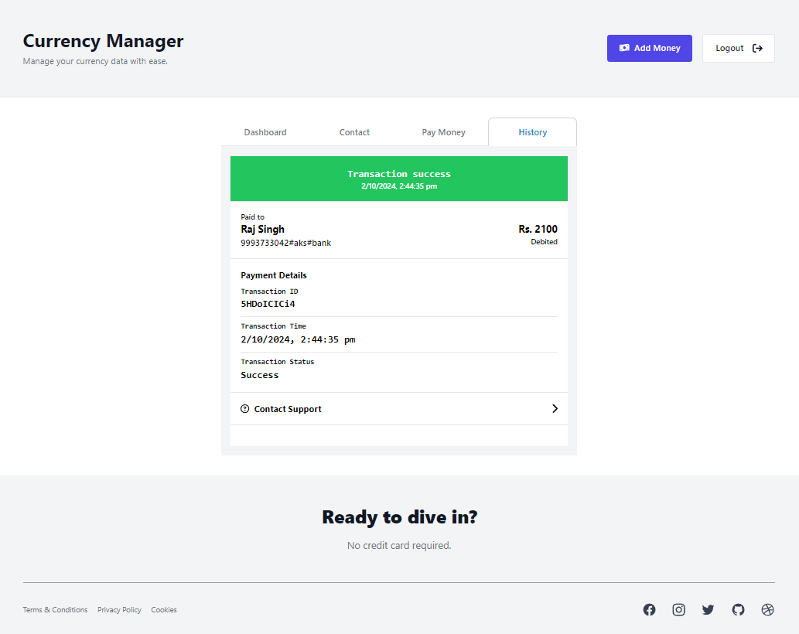

# Currency Manager

## Project Overview

Currency Manager is a web application that allows users to manage their currency transactions efficiently. This project is built using the MERN stack (MongoDB, Express, React, and Node.js) and incorporates essential features like basic CRUD operations, advanced queries with aggregation pipelines, indexing for performance optimization, transaction support, and more. It is also designed with scalability in mind, leveraging MongoDB sharding and replication for high availability.

## Features

- **User Authentication**: Sign-up, login, and session management with secure user data handling.
- **Currency Transactions**: Add, update, delete, and view transaction history.
- **Advanced Queries**: Search and filter transactions based on various criteria (date, amount, etc.).
- **Aggregation Pipelines**: Generate reports, summaries, and statistics for users' transactions.
- **Indexing and Optimization**: Ensures fast performance even with large datasets.
- **MongoDB Transactions**: Atomic operations to ensure safe and reliable transactions.
- **Backup and Restore**: Backup the database and restore it to protect data integrity.
- **Scalability**: Leverages MongoDB sharding and replication for high availability.

## Preview of Web-App










## Technologies

- **Frontend**: React, TailwindCSS
- **Backend**: Node.js, Express.js, MongoDB
- **Database**: MongoDB (with replication and sharding for scalability)
- **State Management**: React Hooks (with custom hooks for API handling)
- **Authentication**: JWT (JSON Web Tokens) with refresh tokens for secure access
- **Other Tools**: bcrypt for password hashing, fetch API for making HTTP requests

## Folder Structure

```folder
currency-manager/
│
├── backend/
│   ├── config/
│   ├── controllers/
│   ├── models/
│   ├── routes/
│   ├── utils/
│   ├── server.js
│   └── package.json
│
├── frontend/
│   ├── public/
│   ├── src/
│   ├── ├── components/
│   ├── ├── pages/
│   ├── ├── hooks/
│   └── └── App.js
│   └── package.json
│
├── .gitignore
├── README.md
└── package.json
```

## Installation

### Prerequisites

- [Node.js](https://nodejs.org/) (v14+)
- [MongoDB](https://www.mongodb.com/try/download/community) (v4+)
- [npm](https://www.npmjs.com/)

### Backend Setup

1. Clone the repository:

   ```bash
   git clone https://github.com/your-username/currency-manager.git
   cd currency-manager/backend
   ```

2. Install dependencies:

   ```bash
   npm install
   ```

3. Create a `.env` file in the `backend/` directory:

   ```bash
   touch .env
   ```

   Add the following environment variables to `.env`:

   ```env
   PORT=5000
   MONGO_URI=your_mongodb_connection_string
   JWT_SECRET=your_jwt_secret
   ```

4. Start the backend server:

   ```bash
   npm start
   ```

### Frontend Setup

1. Navigate to the `frontend/` folder:

   ```bash
   cd ../frontend
   ```

2. Install dependencies:

   ```bash
   npm install
   ```

3. Start the frontend development server:

   ```bash
   npm start
   ```

The frontend will be running on `http://localhost:3000` and the backend on `http://localhost:5000`.

## API Endpoints

### User Routes

- **POST /api/users/register**: Register a new user.
- **POST /api/users/login**: User login and token generation.
- **GET /api/users/profile**: Fetch the user's profile details (authentication required).

### Transaction Routes

- **POST /api/transactions**: Add a new transaction (authentication required).
- **GET /api/transactions**: Get all transactions (authentication required).
- **PUT /api/transactions/:id**: Update a transaction by ID (authentication required).
- **DELETE /api/transactions/:id**: Delete a transaction by ID (authentication required).

### Utility Routes

- **POST /api/refresh-token**: Refresh the JWT access token using a refresh token.

## Frontend

### Custom Hooks

We use a custom hook for API handling in the frontend.

```js
// src/hooks/useFetch.js
import { useState, useEffect } from 'react';

export const useFetch = (url, options) => {
  const [data, setData] = useState(null);
  const [error, setError] = useState(null);

  useEffect(() => {
    const fetchData = async () => {
      try {
        const response = await fetch(url, options);
        const result = await response.json();
        setData(result);
      } catch (err) {
        setError(err);
      }
    };
    fetchData();
  }, [url, options]);

  return { data, error };
};
```

### Pages and Components

- **Dashboard**: Display user transactions and financial data.
- **Transaction Form**: Add/edit transactions.
- **Authentication**: Sign-in and register forms for users.

## Backend

The backend API is structured with MVC principles, separating concerns for easier maintenance.

- **Controllers**: Manage the logic for handling requests and processing data.
- **Routes**: Define API endpoints and their corresponding controller functions.
- **Models**: Define MongoDB schema for `User` and `Transaction`.
- **Middleware**: Middleware for authentication and error handling.

### Transactions Model

```js
const mongoose = require('mongoose');

const transactionSchema = new mongoose.Schema({
  userId: {
    type: mongoose.Schema.Types.ObjectId,
    ref: 'User',
    required: true,
  },
  amount: {
    type: Number,
    required: true,
  },
  currency: {
    type: String,
    required: true,
  },
  date: {
    type: Date,
    default: Date.now,
  },
  description: String,
});

module.exports = mongoose.model('Transaction', transactionSchema);
```

## License

This project is licensed under the MIT License.
